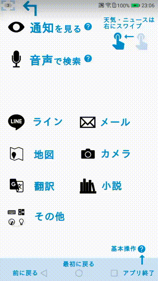

# シニア向けかんたんスマホを自力で実現した話

母（70くらい）にスマホを持たせることにした。
当初はちょっとセットアップすれば母でも使えるようにできるだろうと目論んでいたが、やってみると「もう少しこうしたい」が積み重なって、結果大変だったので、知見の共有ために記録を残す。

## 端末
- Huawei nova 2にした。Android 7系が動いて、軽くて、一番安いという条件に合って中古で買った。auのアプリがいくつか入っていてうざい
- 持ち運びは諦めてタブレットにしても良かったかもしれない。

## 外観

黒いアイコンをタップするとアプリが起動。青いはてなマークはヘルプを表示するアプリが起動する。

## やったこと
### 壁紙に説明を書いた

通知や画面下部のアイコンの説明などを壁紙に書いてホーム画面に常に表示されるようにした。
ぱっと見でどれがアイコンかわかるようにアプリのアイコンを黒で、説明の文字とヘルプのアイコンは青で統一した。

### フォルダとショートカットを活用
フォルダを利用して、メニューっぽくホーム画面からやりたいことを選択できるようにした。
"XXとLineする"、"音声で翻訳する"など、フォルダ内にショートカットを置いて、アプリ側に移ってからの操作を減らすようにした。

### ホーム画面のカスタマイズ

[nova launcher](https://play.google.com/store/apps/details?id=com.teslacoilsw.launcher)を使った。使った機能は以下など：

- ホーム画面のグリッド数を増やして、アイコン間の隙間を増やした
- 機能がわかりやすいアイコンに変更(stamped black iconsを使用したが、もう黒はなくなった？)
- ホーム画面でのアプリ名を非表示にして、代わりに壁紙に大きく書いた。
- カメラ→撮る、ギャラリー→見る、など、操作がわかる名前に変更した。メール送信先の入力は一部入力すると候補が補完されるUIで厳しそうなので、「メール」→「相手を選ぶ」で連絡先アプリを開き、そこからメール作成画面に遷移するように促した。
- 「通知を見る」の目のアイコンは、通知を表示するためのショートカットになっている。画面の上の方をスワイプという説明が煩雑だったので、タップだけでできるようにした。
- ホーム画面の変更をロック

### アプリの強制終了

割り切って、画面下の□は「アプリ終了」のためのボタンということにして、都度全アプリを終了するように伝えた(□を押した後のアプリ一覧でゴミ箱をタップ)。
Androidの標準的な作法ではないが、アプリの状態に応じた判断をなくし、ホーム画面から同じ手順をやれば、同じ操作ができるようにした。

### フォントサイズを”大”にした
Android7.0(？)からAndroidの設定でフォントサイズを変更できる。どのアプリでも大体の文字が大きくなる。
たまに文字の表示切れをしているケースもあるが致命的なことはなさそう。

### ホーム画面の２枚目にニュースと天気予報のウィジェットを配置
スワイプ操作を常日頃から使うようにして、スマホっぽい操作も慣れていけるように。
ページを切り替えたときに壁紙も一緒に動いてほしかったけど、だめだった。nova launcherとhuaweiが勝手に入れてる何かの相性の問題の気がしている。

### ヘルプの表示
ホーム画面からカテゴリごとのヘルプをみれるようにするやっつけアプリを作った。→[コード](https://github.com/illiichi/JustGuide)

最初は操作している様子のスクリーンキャストを見せればいいかと思っていたが、
実際にやってみると、それでは全然分かりそうになかった。
結局、スクリーンショットに説明を加えたものを紙芝居形式で見せるようにした。

アプリ自体は書き殴る感じですぐできたが、
スクリーンショットを撮って説明を加えるというSIerの新人のような作業がつらかった。
10～20分のちょっとした空き時間で少しずつ作業を進めて3週間くらいかけてやった。
シニアユーザーが対象なので、文字は大きく、画面はすっきりさせる必要がある。
文字数や用語が限定されるし、どう説明するか考えるのはなかなか悩ましく、すこし楽しかった。
さっさと終わらせたいと思いつつ、細かいところが気になって、キリをつけるのが大変だった。

ヘルプを見ながらアプリを操作をするためには、アプリを切り替えるという高等操作が必要になるので、
もう一台古い端末を渡して、ヘルプ見る用にした。
古いAndroidにも対応しなければならなくなったが、面倒だったのでハードコーディングなど駆使して、雑に対応した。

### その他
- Google Mapはスマホ慣れしてないと難しい操作が多かったので、他の地図アプリを探すことにした。
経路探索にローカルバスの路線（実家的に重要）も出てきたのでYahoo! 地図にした。
Webなどからの動線でGoogle mapに飛ばされた時とか混乱するかもしれない

- ランチャアプリが落ちると、下図のように自動的にデフォルトアプリに戻す機能が作動した(アンインストールまで勧めてくる)。
デフォルトランチャに戻ってしまった場合に、デフォルトランチャのトップに復旧手順へのリンクを置いておいた。

